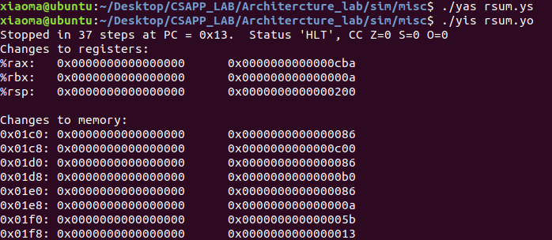
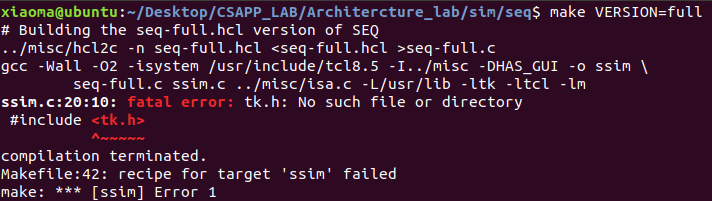
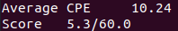

# Architecture_lab

> 作者：Xiaoma
>
> 完成时间：2023.1.31


## 实验目的

> Part A : 编写简单的`Y86-64`程序 
> 
> Part B : 拓展SEQ指令
> 
> Part C : 优化程序执行效率

## 环境
Ubuntu18.04


## 实验步骤与内容

### 预处理

在按照`archlab.pdf`进行`make`操作时，可能会缺少依赖。

解决方法
```
sudo apt install tcl tcl-dev tk tk-dev
sudo apt install flex
sudo apt install bison
```

### **Part A**
> Part A在 `sim/misc`目录下完成
>
> 使用`Y86-64`编写并模拟`examples.c`中的三个实例函数

通过阅读`examples.c`中的代码可知，三个函数的操作均与链表有关。

链表的结构为
```C
typedef struct ELE {
    long val;
    struct ELE *next;
} *list_ptr;
```

**sum.ys**

该函数的C语言代码为
```C
/* sum_list - Sum the elements of a linked list */
long sum_list(list_ptr ls)
{
    long val = 0;
    while (ls) 
    {
        val += ls->val;
        ls = ls->next;
    }
    return val;
}
```

使用`Y86-64`实现为

```asm
# Iteratively sum linked list elements
# Xiaoma

# Execution begins at address 0
    .pos 0
    irmovq stack, %rsp
    call main
    halt

# Sample linked list
    .align 8
ele1:
    .quad 0x00a
    .quad ele2
ele2:
    .quad 0x0b0
    .quad ele3
ele3:
    .quad 0xc00
    .quad 0

main:
    irmovq ele1, %rdi
    call sum_list
    ret

# start in %rdi

sum_list:
    irmovq $0, %rax
    jmp test

loop:
    mrmovq (%rdi), %rsi
    addq %rsi, %rax
    mrmovq 8(%rdi), %rdi

test:
    andq %rdi, %rdi
    jne loop
    ret

#stack starts here and grows to lower addresses
    .pos 0x200
stack:   
 
```

验证答案
```
./yas sum.ys
./yis sum.yo
```


**sum.ys**完成

**rsum.ys**

该函数的C语言代码为
```C
/* rsum_list - Recursive version of sum_list */
long rsum_list(list_ptr ls)
{
    if (!ls)
	return 0;
    else 
    {
        long val = ls->val;
        long rest = rsum_list(ls->next);
        return val + rest;
    }
}
```

使用`Y86-64`实现为

```asm
# Recursively sum linked list elements
# Xiaoma

# Execution begins at address 0
    .pos 0
    irmovq stack, %rsp
    call main
    halt

# Sample linked list
    .align 8
ele1:
    .quad 0x00a
    .quad ele2
ele2:
    .quad 0x0b0
    .quad ele3
ele3:
    .quad 0xc00
    .quad 0

main:
    irmovq ele1, %rdi
    call rsum_list
    ret

# start in %rdi
rsum_list:
    andq %rdi, %rdi
    je return
    mrmovq (%rdi), %rbx
    mrmovq 8(%rdi), %rdi
    pushq %rbx
    call rsum_list
    popq %rbx
    addq %rbx, %rax
    ret

return:
    irmovq $0, %rax
    ret

#stack starts here and grows to lower addresses
    .pos 0x200
stack:   
     
```

验证答案
```
./yas rsum.ys
./yis rsum.yo
```



**rsum.ys**完成


**copy.ys**
该函数的C语言代码为

```C
/* copy_block - Copy src to dest and return xor checksum of src */
long copy_block(long *src, long *dest, long len)
{
    long result = 0;
    while (len > 0) 
    {
        long val = *src++;
        *dest++ = val;
        result ^= val;
        len--;
    }
    return result;
}
```

使用`Y86-64`实现为

```asm
# Copy a source block to a destination block
# Xiaoma

# Execution begins at address 0
    .pos 0
    irmovq stack, %rsp
    call main
    halt

.align 8
# Source block
src:
    .quad 0x00a
    .quad 0x0b0
    .quad 0xc00
# Destination block
dest:
    .quad 0x111
    .quad 0x222
    .quad 0x333

main:
    irmovq src, %rdi
    irmovq dest, %rsi
    irmovq $3, %rdx
    call copy_block
    ret

copy_block:
    irmovq $8, %r8
    irmovq $1, %r9
    irmovq $0, %rax
    jmp test

loop:
    mrmovq (%rdi), %r10
    addq %r8, %rdi
    rmmovq %r10, (%rsi)
    addq %r8, %rsi
    xorq %r10, %rax
    subq %r9, %rdx

test:
    andq %rdx, %rdx
    jne loop
    ret

# stack starts here and grows to lower addresses
        .pos 0x200
stack:


```

验证答案
```
./yas copy_block.ys
./yis copy_block.yo
```


**copy.ys**完成

**Part A 完成**

### **Part B**
> Part B在 `sim/seq`目录下完成
>
> 扩展SEQ以支持iaddq

由于实验版本问题，若在测试阶段出现问题可以通过下列对应解决方案解决。

1. `make VERSION=full`
   
   

    将`Makefile`中的第20行修改为
    
    `TKINC=-isystem /usr/include/tcl8.6`

    将第26行修改为
    
    `CFLAGS=-Wall -O2 -DUSE_INTERP_RESULT`

2.  `make VERSION=full`

    

    将`sim/seq/ssim.c`中的第844，845行删除

    将`sim/pipe/psim.c`中的第806，807行删除


参考书P266中的图"Y86-64指令OPq，rrmovq和irmovq在顺序实现中的计算"

```
阶段    OPq rA, rB              irmovqV, rB

取指    icode:ifun <- M_1[PC]   icode:ifun <- M_1[PC]
        rA:rB <- M_1[PC+1]      rA:rB <- M_1[PC+1]
                                valC <-M_8[PC+2]
        valP <- PC+2            valP <- PC+10 

译码    valA <- R[rA]
        valB <- R[rB]

执行    valE <- valB OP valA    valE <- 0+valC
        SetCC

访存    

写回    R[rB] <- valE           R[rB] <- valE

更新PC  PC <- valP              PC <- valP
```

则iaddq在顺序实现中的计算为

```
阶段    iaddqV, rB

取值    icode:ifun <- M_1[PC]
        rA:rB <- M_1[PC+1]
        valC <- M_8[PC+2]
        valP <- PC+10 

译码    valB <- R[rB]

执行    valE <- valB + valC
        SetCC

访存

写回    R[rB] <- valE

更新PC  PC <- valP
```

更改`seq-full.hcl`中的代码

**取指阶段**

```hcl
bool instr_valid = icode in 
	{ INOP, IHALT, IRRMOVQ, IIRMOVQ, IRMMOVQ, IMRMOVQ,
	       IOPQ, IJXX, ICALL, IRET, IPUSHQ, IPOPQ, IIADDQ };
```

```hcl
# Does fetched instruction require a regid byte?
bool need_regids =
	icode in { IRRMOVQ, IOPQ, IPUSHQ, IPOPQ, 
		     IIRMOVQ, IRMMOVQ, IMRMOVQ, IIADDQ };
```

```hcl
# Does fetched instruction require a constant word?
bool need_valC =
	icode in { IIRMOVQ, IRMMOVQ, IMRMOVQ, IJXX, ICALL, IIADDQ };
```

**译码阶段**
```hcl
## What register should be used as the B source?
word srcB = [
	icode in { IOPQ, IRMMOVQ, IMRMOVQ, IIADDQ  } : rB;
	icode in { IPUSHQ, IPOPQ, ICALL, IRET } : RRSP;
	1 : RNONE;  # Don't need register
];
```

```hcl
## What register should be used as the E destination?
word dstE = [
	icode in { IRRMOVQ } && Cnd : rB;
	icode in { IIRMOVQ, IOPQ, IIADDQ} : rB;
	icode in { IPUSHQ, IPOPQ, ICALL, IRET } : RRSP;
	1 : RNONE;  # Don't write any register
];
```

执行阶段

```hcl
## Select input A to ALU
word aluA = [
	icode in { IRRMOVQ, IOPQ } : valA;
	icode in { IIRMOVQ, IRMMOVQ, IMRMOVQ, IIADDQ } : valC;
	icode in { ICALL, IPUSHQ } : -8;
	icode in { IRET, IPOPQ } : 8;
	# Other instructions don't need ALU
];

```

```hcl
## Select input B to ALU
word aluB = [
	icode in { IRMMOVQ, IMRMOVQ, IOPQ, ICALL, 
		      IPUSHQ, IRET, IPOPQ, IIADDQ } : valB;
	icode in { IRRMOVQ, IIRMOVQ } : 0;
	# Other instructions don't need ALU
];
```

```hcl
## Should the condition codes be updated?
bool set_cc = icode in { IOPQ, IIADDQ };
```

其余阶段均不需要修改

验证答案
```
make VERSION=full
./ssim -t ../y86-code/asumi.yo
```


```
cd ../y86-code; make testssim
```


```
cd ../ptest; make SIM=../seq/ssim
```


```
cd ../ptest; make SIM=../seq/ssim TFLAGS=-i
```


**Part B 完成**

**Part C**
> Part B在 `sim/pipe`目录下完成
>
> 修改代码以提升程序效率

查看`ncopy.c`中的`ncopy`函数

```C
/* $begin ncopy */
/*
 * ncopy - copy src to dst, returning number of positive ints
 * contained in src array.
 */
word_t ncopy(word_t *src, word_t *dst, word_t len)
{
    word_t count = 0;
    word_t val;

    while (len > 0) 
    {
        val = *src++;
        *dst++ = val;
        if (val > 0)
            count++;
        len--;
    }
    return count;
}
/* $end ncopy */
```

阅读代码可以得知，该函数的功能为将数组src的前len个数字复制到数组dst中并计算非零值的个数。

查看`ncopy.ys`中ncopy的实现

```
#/* $begin ncopy-ys */
##################################################################
# ncopy.ys - Copy a src block of len words to dst.
# Return the number of positive words (>0) contained in src.
#
# Include your name and ID here.
#
# Describe how and why you modified the baseline code.
#
##################################################################
# Do not modify this portion
# Function prologue.
# %rdi = src, %rsi = dst, %rdx = len
ncopy:

##################################################################
# You can modify this portion
	# Loop header
	xorq %rax,%rax		# count = 0;
	andq %rdx,%rdx		# len <= 0?
	jle Done		# if so, goto Done:

Loop:	mrmovq (%rdi), %r10	# read val from src...
	rmmovq %r10, (%rsi)	# ...and store it to dst
	andq %r10, %r10		# val <= 0?
	jle Npos		# if so, goto Npos:
	irmovq $1, %r10
	addq %r10, %rax		# count++
Npos:	irmovq $1, %r10
	subq %r10, %rdx		# len--
	irmovq $8, %r10
	addq %r10, %rdi		# src++
	addq %r10, %rsi		# dst++
	andq %rdx,%rdx		# len > 0?
	jg Loop			# if so, goto Loop:
##################################################################
# Do not modify the following section of code
# Function epilogue.
Done:
	ret
##################################################################
# Keep the following label at the end of your function
End:
#/* $end ncopy-ys */
```

我们需要修改`ncopy.ys`和`pipe-full.hcl`来提升程序运行效率。

首先在不进行修改的情况下对其进行测试

```
make drivers
make psim VERSION=full
./benchmark.pl
```


**添加IADDQ指令**

我们可以考虑添加IADDQ指令，参考Part B修改`pipe-full.hcl`

测试pipeline simulator

```
cd ../y86-code; make testpsim
```


```
cd ../ptest; make SIM=../pipe/psim TFLAGS=-i
```


观察结果可以得知pipeline simulator通过了回归测试，接下来修改`ncopy.ys`中的相关指令

将该类型的指令替换为IADDQ指令
```
irmovqV, rB
addq rB, rC

iaddqV, rC
```


测试改进后的结果

```
make drivers
./benchmark.pl
```


**更改分支预测**

观察`ncopy.ys`中的代码可知，在第20行的分支预测中，`len <= 0`的概率远小于`len > 0`。


故将原代码修改为


测试改进后的结果

```
make drivers
./benchmark.pl
```


**改善数据冒险**

参考书P267中的图"Y86-64指令rmmovq和mrmovq在顺序实现中的计算"

```
阶段    rmmovq rA, D(rB)              mrmovq D(rB), rA

取指    icode:ifun <- M_1[PC]   icode:ifun <- M_1[PC]
        rA:rB <- M_1[PC+1]      rA:rB <- M_1[PC+1]
        valC <- M_8[PC+2]       valC <- M_8[PC+2]
        valP <- PC+10           valP <- PC+10 

译码    valA <- R[rA]
        valB <- R[rB]           valB <- R[rB]

执行    valE <- valB + valC    valE <- valB + valC

访存    M_8[valE] <- valA      valM <- M_8[valE]

写回                           R[rA] <- valM

更新PC  PC <- valP              PC <- valP
```

对于`ncopy.ys`的第24行


程序在执行过程中会发生数据冒险，故将数组指针的自增操作移动至两指令之间，可以节约在解决数据冒险时采用的插泡操作造成的效率降低。

故将原代码修改为


测试改进后的结果

```
make drivers
./benchmark.pl
```


**优化循环次数**

若一次循环复制多个数字，则可以减少额外Nops开销，考虑到寄存器数量限制，每次循环最多可以复制10个数字，若剩余数字少于10个则复制2个数字。

故将原代码修改为

```
# You can modify this portion
	# Loop header
	xorq %rax,%rax		# count = 0;
	andq %rdx,%rdx		# len <= 0?
	jne init
	ret

init:
	iaddq $-10,%rdx		
	andq %rdx,%rdx		
	jl initRemain

one:	
	mrmovq (%rdi), %r8	
	mrmovq 8(%rdi),%r9	
	rmmovq %r8, (%rsi)	
	rmmovq %r9,8(%rsi)
	andq %r8, %r8		
	jle two			
	iaddq $1,%rax
two:						
	andq %r9,%r9
	jle three
	iaddq $1, %rax		
three:
	mrmovq 16(%rdi),%r8
	mrmovq 24(%rdi),%r9
	rmmovq %r8,16(%rsi)
	rmmovq %r9,24(%rsi)
	andq %r8,%r8
	jle four
	iaddq $1,%rax
four:
	andq %r9,%r9
	jle five
	iaddq $1,%rax
five:
	mrmovq 32(%rdi),%r8
	mrmovq 40(%rdi),%r9
	rmmovq %r8,32(%rsi)
	rmmovq %r9,40(%rsi)
	andq %r8,%r8
	jle six
	iaddq $1,%rax
six:
	andq %r9,%r9
	jle seven
	iaddq $1,%rax
seven:
	mrmovq 48(%rdi),%r8
	mrmovq 56(%rdi),%r9
	rmmovq %r8,48(%rsi)
	rmmovq %r9,56(%rsi)
	andq %r8,%r8
	jle eight
	iaddq $1,%rax
eight:
	andq %r9,%r9
	jle nine
	iaddq $1,%rax
nine:
	mrmovq 64(%rdi),%r8
	mrmovq 72(%rdi),%r9
	rmmovq %r8,64(%rsi)
	rmmovq %r9,72(%rsi)
	andq %r8,%r8
	jle ten
	iaddq $1,%rax
ten:
	andq %r9,%r9
	jle Npos
	iaddq $1,%rax
Npos:	
	iaddq $80, %rdi			
	iaddq $80, %rsi			
	jmp init			

initRemain:				
	iaddq $8,%rdx			
	andq %rdx,%rdx
	jl remain
oneRemain:
	mrmovq (%rdi),%r8
	mrmovq 8(%rdi),%r9
	rmmovq %r8,(%rsi)
	rmmovq %r9,8(%rsi)
	andq %r8,%r8
	jle twoRemain
	iaddq $1,%rax
twoRemain:
	andq %r9,%r9
	jle NposRemain
	iaddq $1,%rax
NposRemain:
	iaddq $16,%rdi
	iaddq $16,%rsi
	iaddq $-2,%rdx
	andq %rdx,%rdx	
	jge oneRemain

remain:
	iaddq $1,%rdx		
	jl Done
	mrmovq (%rdi), %r10	
	iaddq $8, %rdi		
	rmmovq %r10, (%rsi)	
	iaddq $8, %rsi		
	iaddq $-1,%rdx
	andq %r10, %r10		
	jle Done
	iaddq $1, %rax	
```

测试改进后的结果

```
make drivers
./benchmark.pl
```


继续优化循环，每次复制10个数字，若剩余数字不足10个，则进行判断，复制8/6/4/2个数字

故将原代码修改为

```
# You can modify this portion
	# Loop header
	xorq %rax,%rax		# count = 0;
	andq %rdx,%rdx		# len <= 0?
	jne init
	ret

init:
	iaddq $-10,%rdx		
	andq %rdx,%rdx		
	jl initRemainEight

one:	
	mrmovq (%rdi), %r8	
	mrmovq 8(%rdi),%r9	
	rmmovq %r8, (%rsi)	
	rmmovq %r9,8(%rsi)
	andq %r8, %r8		
	jle two			
	iaddq $1,%rax
two:						
	andq %r9,%r9
	jle three
	iaddq $1, %rax		
three:
	mrmovq 16(%rdi),%r8
	mrmovq 24(%rdi),%r9
	rmmovq %r8,16(%rsi)
	rmmovq %r9,24(%rsi)
	andq %r8,%r8
	jle four
	iaddq $1,%rax
four:
	andq %r9,%r9
	jle five
	iaddq $1,%rax
five:
	mrmovq 32(%rdi),%r8
	mrmovq 40(%rdi),%r9
	rmmovq %r8,32(%rsi)
	rmmovq %r9,40(%rsi)
	andq %r8,%r8
	jle six
	iaddq $1,%rax
six:
	andq %r9,%r9
	jle seven
	iaddq $1,%rax
seven:
	mrmovq 48(%rdi),%r8
	mrmovq 56(%rdi),%r9
	rmmovq %r8,48(%rsi)
	rmmovq %r9,56(%rsi)
	andq %r8,%r8
	jle eight
	iaddq $1,%rax
eight:
	andq %r9,%r9
	jle nine
	iaddq $1,%rax
nine:
	mrmovq 64(%rdi),%r8
	mrmovq 72(%rdi),%r9
	rmmovq %r8,64(%rsi)
	rmmovq %r9,72(%rsi)
	andq %r8,%r8
	jle ten
	iaddq $1,%rax
ten:
	andq %r9,%r9
	jle Npos
	iaddq $1,%rax
Npos:	
	iaddq $80, %rdi			
	iaddq $80, %rsi			
	jmp init			

initRemainEight:				
	iaddq $2,%rdx			
	andq %rdx,%rdx
	jl initRemainSix
oneRemainEight:
	mrmovq (%rdi),%r8
	mrmovq 8(%rdi),%r9
	rmmovq %r8,(%rsi)
	rmmovq %r9,8(%rsi)
	andq %r8,%r8
	jle twoRemainEight
	iaddq $1,%rax
twoRemainEight:
	andq %r9,%r9
	jle threeRemainEight
	iaddq $1,%rax
threeRemainEight:
	mrmovq 16(%rdi),%r8
	mrmovq 24(%rdi),%r9
	rmmovq %r8,16(%rsi)
	rmmovq %r9,24(%rsi)
	andq %r8,%r8
	jle fourRemainEight
	iaddq $1,%rax	
fourRemainEight:
	andq %r9,%r9
	jle fiveRemainEight
	iaddq $1,%rax
fiveRemainEight:
	mrmovq 32(%rdi),%r8
	mrmovq 40(%rdi),%r9
	rmmovq %r8,32(%rsi)
	rmmovq %r9,40(%rsi)
	andq %r8,%r8
	jle sixRemainEight
	iaddq $1,%rax
sixRemainEight:
	andq %r9,%r9
	jle sevenRemainEight
	iaddq $1,%rax
sevenRemainEight:
	mrmovq 48(%rdi),%r8
	mrmovq 56(%rdi),%r9
	rmmovq %r8,48(%rsi)
	rmmovq %r9,56(%rsi)
	andq %r8,%r8
	jle eightRemainEight
	iaddq $1,%rax
eightRemainEight:
	andq %r9,%r9
	jle NposRemainEight
	iaddq $1,%rax
NposRemainEight:
	iaddq $64,%rdi
	iaddq $64,%rsi
	iaddq $-8,%rdx
	andq %rdx,%rdx	
	jge oneRemainEight

initRemainSix:				
	iaddq $2,%rdx			
	andq %rdx,%rdx
	jl initRemainFour
oneRemainSix:
	mrmovq (%rdi),%r8
	mrmovq 8(%rdi),%r9
	rmmovq %r8,(%rsi)
	rmmovq %r9,8(%rsi)
	andq %r8,%r8
	jle twoRemainSix
	iaddq $1,%rax
twoRemainSix:
	andq %r9,%r9
	jle threeRemainSix
	iaddq $1,%rax
threeRemainSix:
	mrmovq 16(%rdi),%r8
	mrmovq 24(%rdi),%r9
	rmmovq %r8,16(%rsi)
	rmmovq %r9,24(%rsi)
	andq %r8,%r8
	jle fourRemainSix
	iaddq $1,%rax	
fourRemainSix:
	andq %r9,%r9
	jle fiveRemainSix
	iaddq $1,%rax
fiveRemainSix:
	mrmovq 32(%rdi),%r8
	mrmovq 40(%rdi),%r9
	rmmovq %r8,32(%rsi)
	rmmovq %r9,40(%rsi)
	andq %r8,%r8
	jle sixRemainSix
	iaddq $1,%rax
sixRemainSix:
	andq %r9,%r9
	jle NposRemainSix
	iaddq $1,%rax
NposRemainSix:
	iaddq $48,%rdi
	iaddq $48,%rsi
	iaddq $-6,%rdx
	andq %rdx,%rdx	
	jge oneRemainSix

initRemainFour:				
	iaddq $2,%rdx			
	andq %rdx,%rdx
	jl initRemainTwo
oneRemainFour:
	mrmovq (%rdi),%r8
	mrmovq 8(%rdi),%r9
	rmmovq %r8,(%rsi)
	rmmovq %r9,8(%rsi)
	andq %r8,%r8
	jle twoRemainFour
	iaddq $1,%rax
twoRemainFour:
	andq %r9,%r9
	jle threeRemainFour
	iaddq $1,%rax
threeRemainFour:
	mrmovq 16(%rdi),%r8
	mrmovq 24(%rdi),%r9
	rmmovq %r8,16(%rsi)
	rmmovq %r9,24(%rsi)
	andq %r8,%r8
	jle fourRemainFour
	iaddq $1,%rax	
fourRemainFour:
	andq %r9,%r9
	jle NposRemainFour
	iaddq $1,%rax
NposRemainFour:
	iaddq $32,%rdi
	iaddq $32,%rsi
	iaddq $-4,%rdx
	andq %rdx,%rdx	
	jge oneRemainFour

initRemainTwo:				
	iaddq $2,%rdx			
	andq %rdx,%rdx
	jl remain
oneRemainTwo:
	mrmovq (%rdi),%r8
	mrmovq 8(%rdi),%r9
	rmmovq %r8,(%rsi)
	rmmovq %r9,8(%rsi)
	andq %r8,%r8
	jle twoRemainTwo
	iaddq $1,%rax
twoRemainTwo:
	andq %r9,%r9
	jle NposRemainTwo
	iaddq $1,%rax
NposRemainTwo:
	iaddq $16,%rdi
	iaddq $16,%rsi
	iaddq $-2,%rdx
	andq %rdx,%rdx	
	jge oneRemainTwo

remain:
	iaddq $1,%rdx		
	jl Done
	mrmovq (%rdi), %r10	
	iaddq $8, %rdi		
	rmmovq %r10, (%rsi)	
	iaddq $8, %rsi		
	iaddq $-1,%rdx
	andq %r10, %r10		
	jle Done
	iaddq $1, %rax		

```

测试改进后的结果

```
make drivers
./benchmark.pl
```



发现得分反而降低了，考虑到测试用例中，最后一次循环剩余8/6个数字的情况较少，故最后一次循环根据判断复制4/2个数字

测试改进后的结果

```
make drivers
./benchmark.pl
```


最后一次循环根据判断复制3/2个数字


可知优化循环部分，最后一次循环根据判断复制4/2个数字可以得到最佳结果

**优化代码细节**

- 对于`Y86-64`寄存器初始值为0，则去掉`xorq %rax,%rax`
- 已知`iaddq`会设置条件吗，则去掉多余的`andq`
  

故将原代码修改为

```
# You can modify this portion
	# Loop header
	iaddq $-10,%rdx			
	jl initRemainFour

one:	
	mrmovq (%rdi), %r8	
	mrmovq 8(%rdi),%r9	
	rmmovq %r8,(%rsi)	
	rmmovq %r9,8(%rsi)	
	andq %r8, %r8		
	jle two			
	iaddq $1,%rax
two:						
	andq %r9,%r9
	jle three
	iaddq $1, %rax		
three:
	mrmovq 16(%rdi),%r8
	mrmovq 24(%rdi),%r9
	rmmovq %r8,16(%rsi)
	rmmovq %r9,24(%rsi)
	andq %r8,%r8
	jle four
	iaddq $1,%rax
four:
	andq %r9,%r9
	jle five
	iaddq $1,%rax
five:
	mrmovq 32(%rdi),%r8
	mrmovq 40(%rdi),%r9
	rmmovq %r8,32(%rsi)
	rmmovq %r9,40(%rsi)
	andq %r8,%r8
	jle six
	iaddq $1,%rax
six:
	andq %r9,%r9
	jle seven
	iaddq $1,%rax
seven:
	mrmovq 48(%rdi),%r8
	mrmovq 56(%rdi),%r9
	rmmovq %r8,48(%rsi)
	rmmovq %r9,56(%rsi)
	andq %r8,%r8
	jle eight
	iaddq $1,%rax
eight:
	andq %r9,%r9
	jle nine
	iaddq $1,%rax
nine:
	mrmovq 64(%rdi),%r8
	mrmovq 72(%rdi),%r9
	rmmovq %r8,64(%rsi)
	rmmovq %r9,72(%rsi)
	andq %r8,%r8
	jle ten
	iaddq $1,%rax
ten:
	andq %r9,%r9
	jle Npos
	iaddq $1,%rax
Npos:	
	iaddq $80, %rdi			
	iaddq $80, %rsi			
	iaddq $-10, %rdx			
	andq %rdx,%rdx		
	jge one			

initRemainFour:					
	iaddq $6,%rdx			
	jl initRemainTwo

oneRemainFour:
	mrmovq (%rdi),%r8
	mrmovq 8(%rdi),%r9
	mrmovq 16(%rdi),%r10
	mrmovq 24(%rdi),%r11
	rmmovq %r8,(%rsi)
	rmmovq %r9,8(%rsi)
	rmmovq %r10,16(%rsi)
	rmmovq %r11,24(%rsi)
	andq %r8,%r8
	jle twoRemainFour
	iaddq $1,%rax
twoRemainFour:
	andq %r9,%r9
	jle threeRemainFour
	iaddq $1,%rax
threeRemainFour:
	andq %r10,%r10
	jle fourRemainFour
	iaddq $1,%rax
fourRemainFour:
	andq %r10,%r10
	jle NposRemainFour
	iaddq $1,%rax
NposRemainFour:
	iaddq $32,%rdi
	iaddq $32,%rsi
	iaddq $-4,%rdx
	jge oneRemainFour

initRemainTwo:				
	iaddq $2,%rdx			
	andq %rdx,%rdx
	jl remain
oneRemainTwo:
	mrmovq (%rdi),%r8
	mrmovq 8(%rdi),%r9
	rmmovq %r8,(%rsi)
	rmmovq %r9,8(%rsi)
	andq %r8,%r8
	jle twoRemainTwo
	iaddq $1,%rax
twoRemainTwo:
	andq %r9,%r9
	jle NposRemainTwo
	iaddq $1,%rax
NposRemainTwo:
	iaddq $16,%rdi
	iaddq $16,%rsi
	iaddq $-2,%rdx
	andq %rdx,%rdx	
	jge oneRemainTwo

remain:
	iaddq $1,%rdx		
	jl Done
	mrmovq (%rdi), %r10	
	iaddq $8, %rdi		
	rmmovq %r10, (%rsi)	
	iaddq $8, %rsi		
	iaddq $-1,%rdx
	andq %r10, %r10		
	jle Done
	iaddq $1, %rax	
```

测试改进后的结果

```
make drivers
./benchmark.pl
```


## 实验总结与分析
由于本人能力有限，故最高只能得到分数47.4/60.0

本次实验中让我了解了`Y86-64`的底层原理，并亲自拓展了指令集，并且让我在修改程序提升效率的过程中，学会了一些避免数据冲突的方法。