# Bomb_lab

> 作者：Xiaoma
>
> 完成时间：2023.1.2


## 实验目的

> 通过给定的bomb.c了解6个phase的结构，并通过反汇编破解并拆除炸弹
>
> 

## 环境
Ubuntu18.04 + gdb


## 实验步骤与内容
首先我们运行可执行文件bomb，我们会得到如下结果
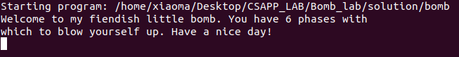

该实验需要我们在运行bomb时在6个phase输入6个字符串，来拆除炸弹，如果当前截断炸弹拆除成功，则执行下一个阶段，若拆除失败，则会提示

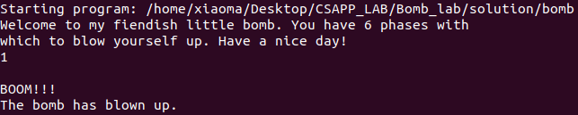
### **phase_1**

我们通过如下步骤进行反汇编
1. 使用gdb运行可执行文件
    ```
    gdb ./bomb
    ```
    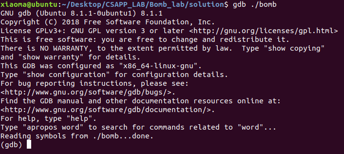
2. 在phase_1的位置设置断点，启动程序，程序执行至断点产生中断
   ```
   break 73
   r
   ```
   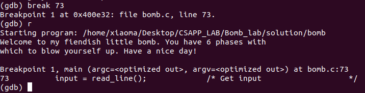
3. 进行反汇编，左侧箭头为`pc`指向位置
   ```
   disassemble $pc
   ```
   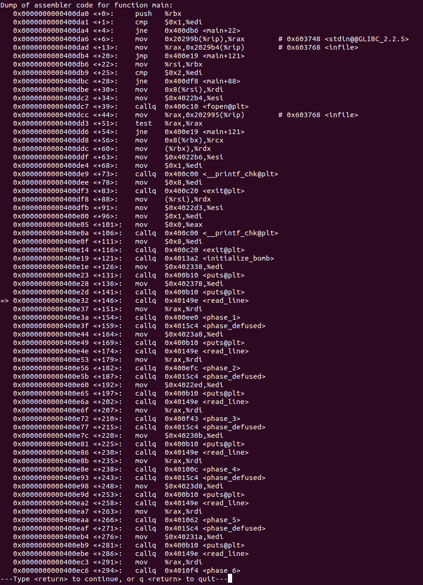
4. 由上图可知，phase_1的地址为`0x400ee0`，对phase_1进行反汇编
   ```
   disassemble 0x400ee0
   ```
   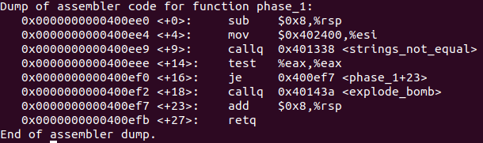

以上是反汇编phase_1的步骤，此后不在赘述。

接下来对phase_1进行分析

-   为函数分配栈帧
-   将`0x402400`传入`%esi`，并将其作为参数调用函数`strings_not_equal`，
-   判断返回值，若ZF=0，则进行跳转
-   释放栈帧，返回结果

对`strings_not_equal`进行反汇编

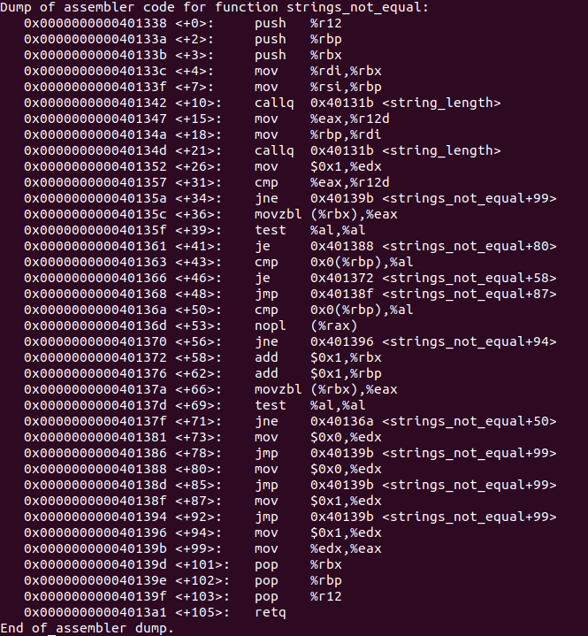

通过阅读代码可知，该函数比较输入字符串与已知字符串，若两字符串相同，则返回0，否则返回1。

所以在phase_1，我们输入的字符串与给定字符串相同时，炸弹被拆除。

获得给定字符串即位置`0x402400`的内容

```
x/s 0x402400
```

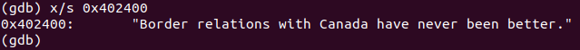

则在第一阶段输入`Border relations with Canada have never been better.`

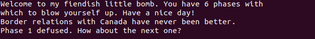

phase_1完成

### **phase_2**

对phase_2进行反汇编

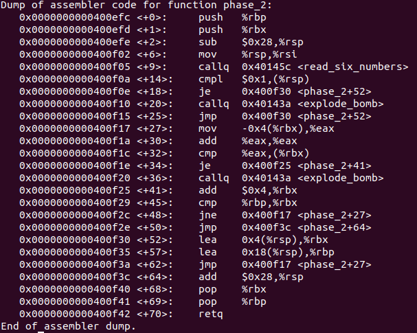

- 保存被调用者的寄存器的值
- 为函数分配栈帧
- 将栈顶指针传入`%rsi`，并将其作为参数调用`read_six_numbers`
- 比较0x1与栈顶中的值，若相等则跳转至`0x400f30`，若不相等则炸弹被引爆
- `0x400f30`中指令将`%rsp + 0x4`传入`%rbx`
- 将`%rsp+0x18`传入`%rbp`
- 跳转至`0x400f17`，将`(%rbx-0x4)`传入`%eax`
- 将`%eax`中的值翻倍后与`(%rbx)`进行比较，若相等则跳转至`0x400f25`，若不相等，则炸弹被引爆
- `0x400f25`中指令执行`%rbx <- %rbx + 0x4 `
- 比较`%rbp`,`%rbx`，若相等则释放栈帧，返回结果，若不相等，则跳转至`0x400f25`

读完该程序以后，可以发现程序似乎是在循环比较栈中的数字，由于`%rbp`中的值为`%rsp + 0x18`，可知循环需要进行6次。

即程序依次比较栈中的数字，栈顶数字为1，剩余5个数字依次为前一个数字的二倍，则6个数字分别为`1 2 4 8 16 32`。

为了验证判断，对`read_six_numbers`进行反汇编

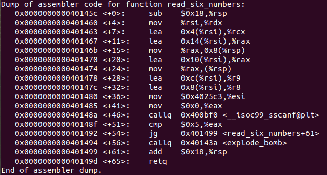

在执行`x401480`中的指令之前，寄存器指向的内容如图所示

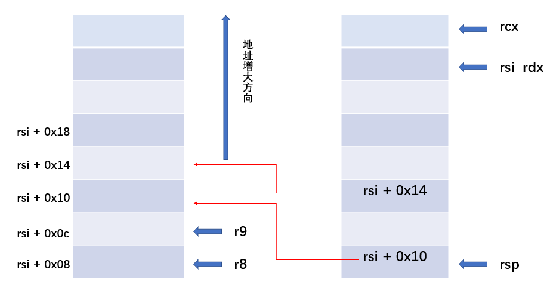

则6个数字存储的位置按照输入顺序分别为

`%rsi %rsi+0x4 %rsi+0x8 %rsi+0xc %rsi+0x10 %rsi+0x14`

当其返回时，调用者的`%rsp`恰好和被调用函数中`%rsi`相等，则判断正确

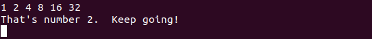

phase_2完成

## **phase_3**

对phase_3进行反汇编

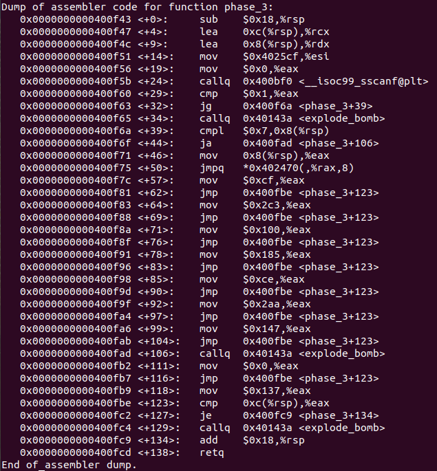

- 为函数分配栈帧
- `%rcx <- (%rsp + 0x8)`,`%rdx <- (%rsp + 0xc)`
- 读入两个整数
- 若整数的数量小于2，则炸弹被引爆
- 将第一个数`(%rsp + 0x8)`与`0x7`比较，若前者大于后者，则炸弹被引爆
- 已知`%rax`为输入的返回值，即第一个数，则程序跳转至`(8 * %rax + 0x402470)`
  
  已知第一个数字的范围为0-7，则计算结果分别为

  `0x402470 0x402478 0x402480 0x402488 0x402490 0x402498 0x4024a0 0x4024a8`

    而这8个地址中存储的内容为

    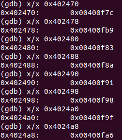

- 分别考虑以上8中情况，发现程序将输入的第二个数与`%eax`中的值进行比较，而8中情况对应8个不同的值，分别为

    `0xcf 0x137 0x2c3 0x100 0x185 0xce 0x2aa 0x147`

则答案分别为

`0 207`
`1 311`
`2 707`
`3 256`

`4 389`
`5 206`
`6 682`
`7 327`

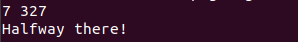

phase_3完成

## **phase_4**

对phase_4进行反汇编

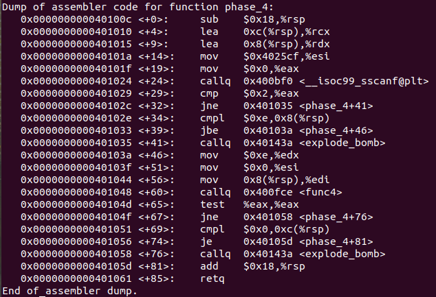

- 前一部分与phase_3几乎完全相同，输入两个数将其存储在`%rsp + 0x8`，`%rsp + 0xc`中，并判断输入数量是否有效。
- 若第一个数大于`0xe`，则炸弹被引爆
- `%edx = 0xe`,`%esi = 0x0`,`%edi = (%rsp + 0x8)`
- 调用`func_4`
- 若返回值`%eax`不为0，则炸弹被引爆
- 当第二个数不为0时，炸弹被引爆

对`func_4`进行反汇编

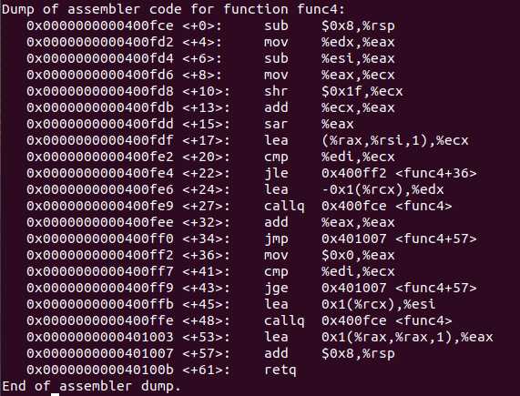

通过观察可知，该函数是一个递归函数

```C++
int func_4(int edx, int esi, int edi)
{
    eax = edx;
    eax -= esi;
    eax = eax + (eax >> 31);
    eax >>= 1;
    ecx = eax + esi;
    if(edi <= ecx)
    {
        eax = 0;
        if(edi >= ecx)
        {
            return eax;
        } 
        else
        {
            esi = ecx + 1;
            eax = func_4(edx, esi, edi);
        }
    }
    else
    {
        edx = ecx - 1;
        eax = func_4(edx, esi, edi);
    }
    return eax;
}
```

我们不需要考虑递归的所有情况，只考虑直接返回0即可，即`edx=7`时，即输入的第一个数为7。

则答案为`7 0`

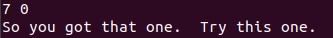

phase_4完成

## **phase_5**

对phase_5进行反汇编

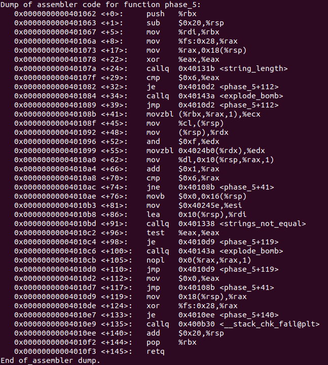


- 为调用者保存`%rbx`
- 为函数分配栈帧
- `%rbx <- %rdi`
- `(%rsp + 0x18) <- (fs:0x28)`，`FS:0x28`是在Linux上存储一个特殊的哨兵堆栈保护值，该指令的目的是保护堆栈
- 将`%eax`清零
- 判断字符串长度，若长度不为6，则炸弹被引爆，否则跳转至`0x4010d2`
- 将`%eax`清零
- 跳转至`0x40108b`
- `%ecx <- (%rbx + %rax)`
- `(%rsp) <- %cl`即将`%ecx`的低8位传送至栈顶指针指向的位置
- 将栈顶的值的低4位传送至`%edx`
- 查看`0x4024b0`的内容
  
    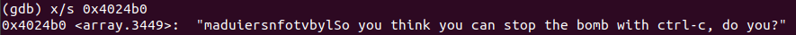

    则`%edx`中的值为`(0x4024b0 + %rdx)`
- 将`%ld`传送至`%rsp + %rax + 0x10`，即将上一步得到的内容存储至栈中
- `%rax`中的值加1
- 判断`%rax`与6是否相等，即循环需要进行6次
- 将`%rsp + 0x16`中的内容清零
- 查看`0x40245e`中的内容

    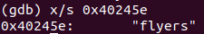

    将字符串的首地址传入`%esi`
- 调用`string_not_equal`，比较字符串，若相同则返回0，否则炸弹被引爆
- 剩余部分为程序结束所执行的内容

已知最后传入`string_not_equal`的字符串应该为`flyers`才能拆除炸弹。

通过阅读代码可知，在循环部分，程序将输入字符的低4位作为索引，来获得`0x4024b0`中存储的字符串中的对应字符。然后将对应字符按照倒序入栈，即存储位置依次增大。

当循环结束时，从`%rsp + 0x10`开始依次存储6个字符，此6个字符组成的字符串即为`flyers`。

`flyers`的6个字符依次对应`maduiersnfotvbylSo you think you can stop the bomb with ctrl-c, do you?`的`9`,`15`,`14`,`5`,`6`,`7`位。

那么我们输入的6个字符的低4为应依次为`1001`,`1111`,`1110`,`0101`,`0110`,`0111`。

则输入的6个字符应为`ionuvw`。

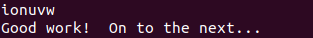

phase_5完成

## **phase_6**

对phase_6进行反汇编

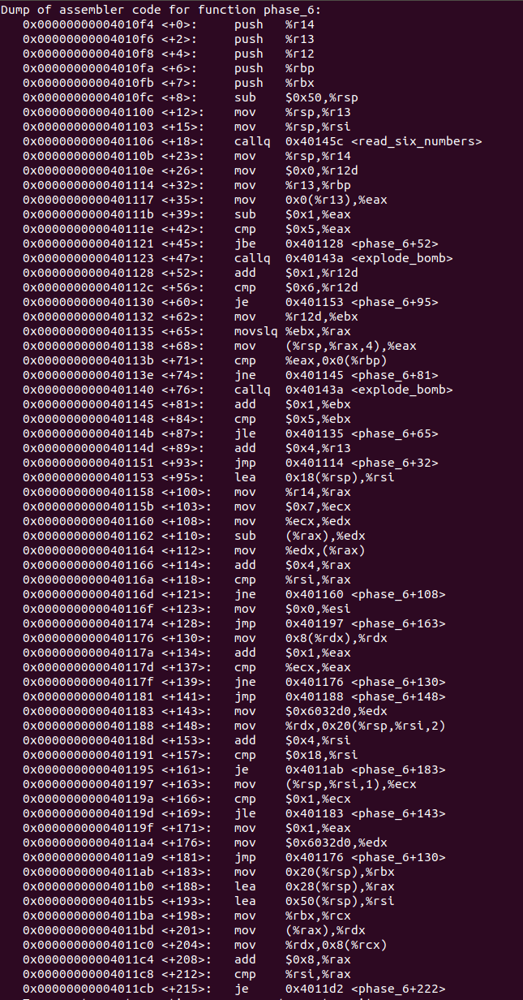
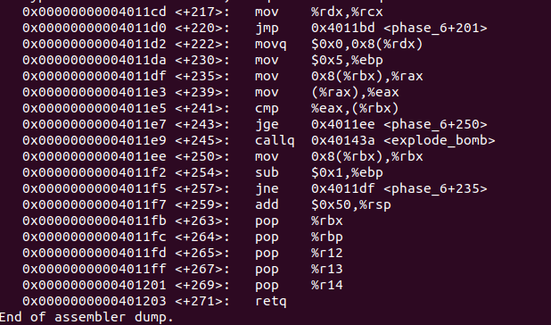


- 为调用者保存寄存器中的内容
- 为函数分配栈帧
- `%r13 <- %rsp`,`%rsi <- %rsp`
- 调用`read_six_numbers`，其已经在phase_2出现过，当其返回时，6个数字存放的位置依次为
  `%rsp`,`%rsp + 0x4`,`%rsp + 0x8`,`%rsp + 0xc`,`%rsp + 0x10`,`%rsp + 0x14`
- `%r14 <- %rsp`,`%r12d <- 0x0`
- `%rbp <- %r13`
- 将第一个数字传入`%eax`，若该数字大于6，则炸弹被引爆
- 将进行6次循环
- 首先比较其余5个数字是否与第一个相同，若相同，则炸弹被引爆
- 循环跳转至`0x401114`，即继续判断后面的数字是否大于6，继续判断数组中的数是否有两两相同的情况
- 将`%rsi`作为数组遍历结束的标志位，我们可以推测这又是一个循环
- 假设数组中的数为`nums[i]`，首先
  `%edx <- 7 - nums[i]`
- 然后`nums[i] <- %edx`
- 由之前的条件可知，经过计算后，数组中的数不相同且都大于0，小于7
- `%esi <- 0x0`
- 跳转至`0x401197`
- 将数组中的元素传送至`%ecx`
- 判断其是否等于1，若等于则跳转至`0x401183`
- 根据下面的代码可知，最多循环6次，则查看`0x6032d0`以及其后面的内容
  
  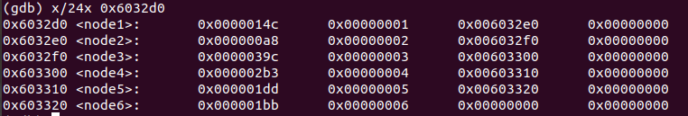

  查阅资料可知，存储内容为长度为6的链表，第三个变量值为`next`指针

- 若数组中的元素为1，则栈中`%rsp + 2 * %rsi + 0x20`存储的是第一个节点
- 若`nums[i] > 1`，则指向第一个节点的指针向后移动`nums[i] - 1`次，将该节点存入位置`%rsp + 2 * %rsi + 0x20`，已知数组中元素各不相同，则栈中存放的节点也各不相同
- `%rbx <- (%rsp + 0x20)`
- `%rax <- %rsp + 0x28`
- `%rsi <- %rsp + 0x50`
- 阅读代码可知下面的循环按照节点在栈中的顺序将重排链表
- `(%rdx + 0x8) <- 0x0`
- `%ebp <- 0x5`
- `%rax <- (%rbx + 0x8)`即该寄存器中存储第二个节点的地址值
- `%eax <- (%rax)`该寄存器存储第二个节点的值
- 如果第一个节点的值小于第二个节点，则炸弹被引爆
- 进行5次循环，即当前一个节点的值大于后一个节点时，炸弹才能被拆除。
- 程序结束

我们已经知道了每个节点的值，按照原顺序，依次为`0x14c`,`0xa8`,`0x39c`,`0x2b3`,`0x1dd`,`0x1bb`，当其顺序满足`0x39c`,`0x2b3`,`0x1dd`,`0x1bb`,`0x14c`,`0xa8`时，炸弹被拆除。

即链表重排的顺序为`node[3] -> node[4] -> node[5] -> node[6] -> node[1] -> node[2]`，已知输入的6个数字参与重排链表之前要进行运算`7 - nums[i]`，则答案为`4 3 2 1 6 5`。


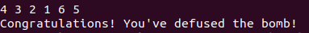

phase_6完成

## secret_phase

在阅读`bomb.c`时，我们在最后发现这样一句话

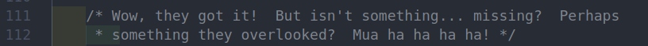

尝试反汇编`phase_defused`

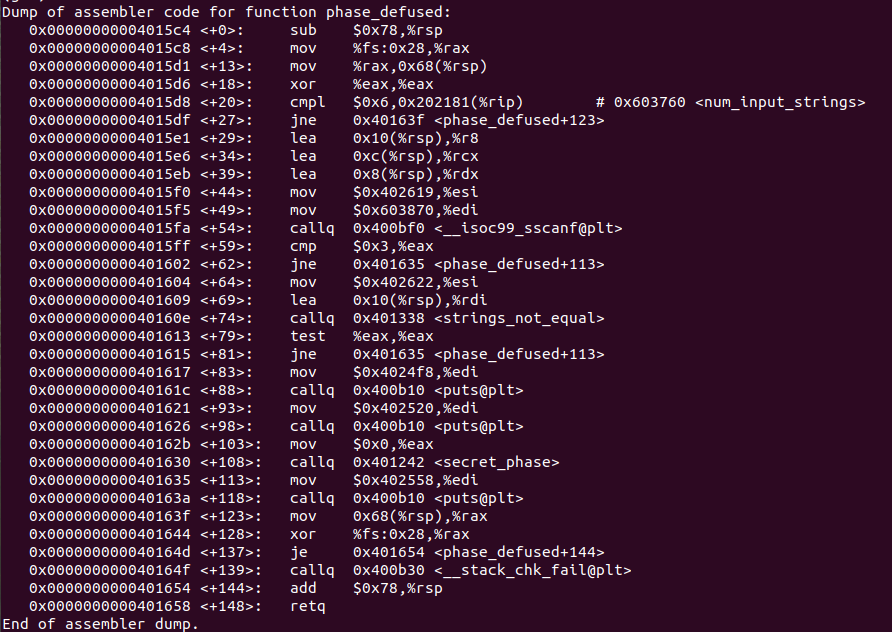

查看`0x402619`中的内容

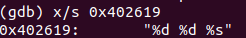

查看`0x603870`中的内容，显然内容为空

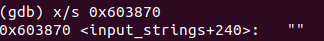

查看`0x402622`中的内容

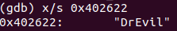

阅读代码可知，当输入满足两个数字和一个字符串`DrEvil`时，可以进入secret_phase。

但我们知道phase_3,phase_4的答案都是两个数字，所以在哪个phase输入是未知的。

已知在之前的phase中，输入的内容的地址都会存入`%rsi`
，尝试在每个phase打印`%rsi`中的内容

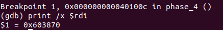

发现phase_4输入的字符串的地址与触发secret_phase需要比较的字符串的地址相同，所以在phase_4输入`7 0 DrEvil`可以触发secret_phase。

反汇编secret_phase

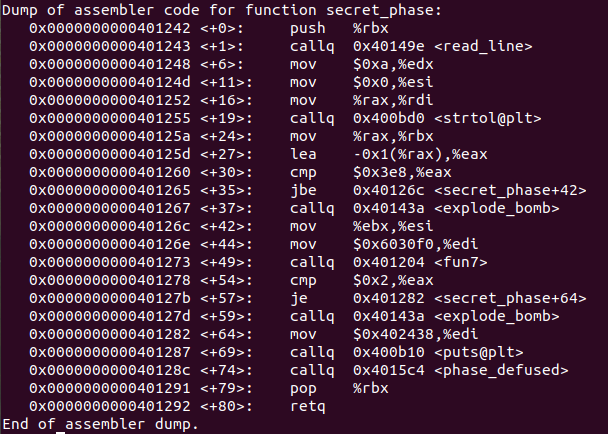

- 保存调用者的寄存器中的内容
- `%edx <- 0xa`,`%esi <- 0x0`,`%rdi <- %rax`
- 调用`strtol`将字符串转换成对应的整数
- 该整数若小于1或大于1001时，炸弹被引爆
- `%esi <- %ebx`
- 查看`0x6030f0`中存储的内容

  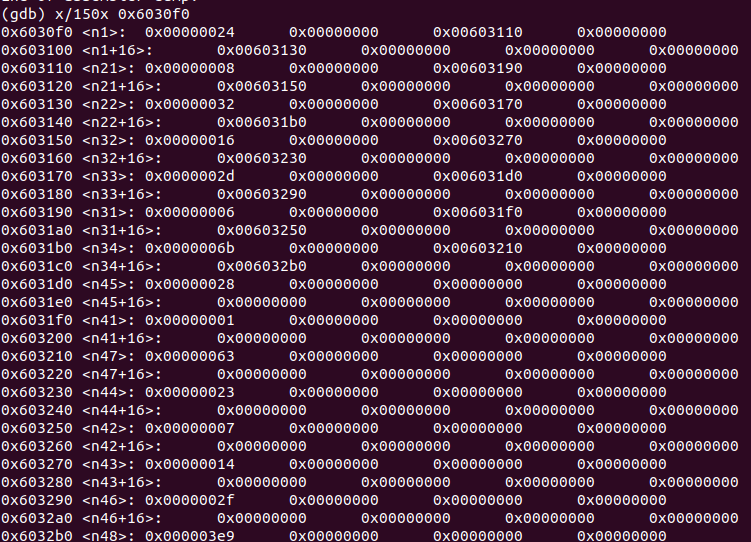

    内容按照树结构存储

    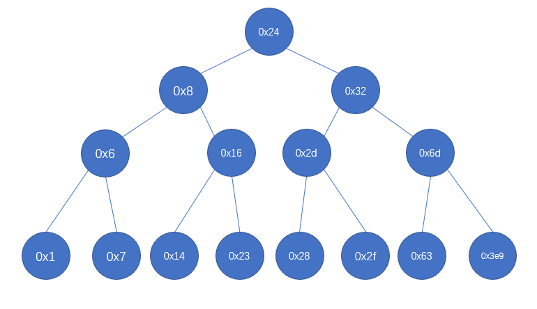

    观察可以发现，其不仅是一棵树，还是二叉搜素树
- 调用`fun7`，当返回值不为2时，炸弹被引爆
- 程序结束

反汇编`fun7`

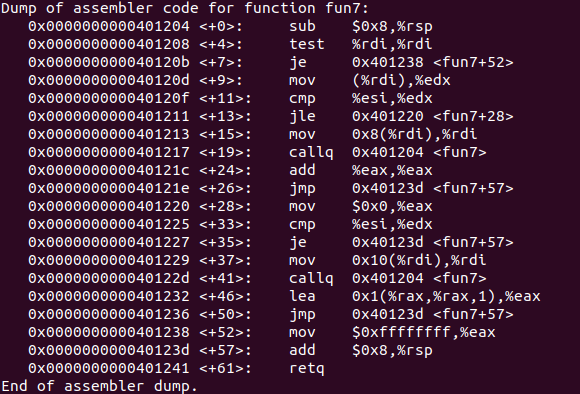

观察可以发现，`fun7`是一个递归函数

```C++
/*
struct BTree
{
    int val;
    struct BTree* left, *right;
}
*/

int fun7(BTree* rdi, int esi)
{
    if(!rdi)
    {
        return -1;
    }
    else
    {
        if(rdi -> val <= esi)
        {
            if(rdi -> val == esi)
            {
                return 0;
            }
            else
            {
                return 1 + 2 * fun7(rdi -> right, esi);
            }
        }
        else
        {
            return 2 * fun7(rdi -> left, esi);
        }
    }
}
```

我们希望返回值为2，则上一次返回值一定为1，即`fun7(rdi -> left, esi)`返回1，推断可知`%esi`中的值为`0x16`。

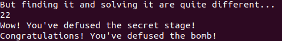

secret_phase完成
## 结论分析与体会

本次实验极大的提高了我对汇编程序的阅读理解能力，并且掌握了简单的gdb调试步骤。


