# [Architecture_lab](http://csapp.cs.cmu.edu/2e/cachelab.pdf)

> 作者：Xiaoma
>
> 完成时间：2023.4.27


## 实验目的

> Part A : 编写一个简单的Cache Simulator
> 
> Part B : 


## 环境
Ubuntu18.04


## 实验步骤与内容

### **PART A**
> 在`csim.c`中编写一个Cache Simulator，将valgrind内存跟踪作为输入，模拟cache的命中/未命中行为，并输出命中、未命中和清除的总数

分组cache的结构如图所示（仅考虑本次实验的结构，省略了cache修改标志等内容）

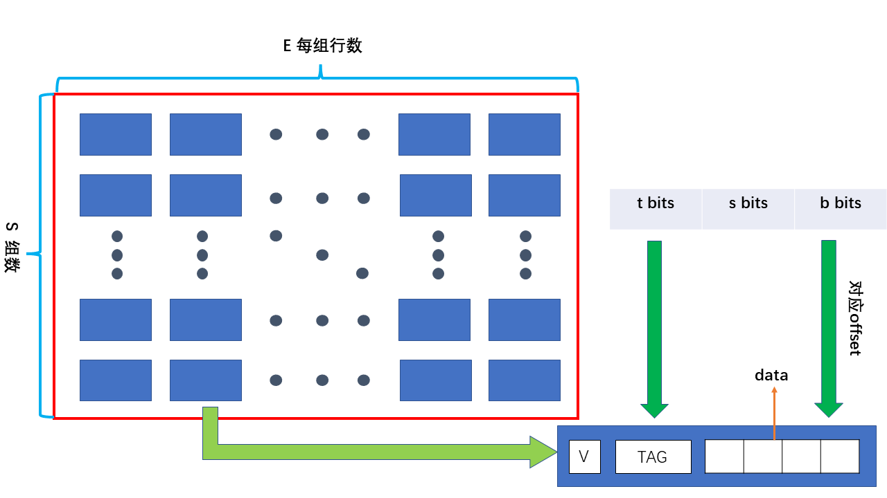

由图片可知，每个cache行由有效位V、标志位TAG、数据DATA组成，而对于整个cache而言，应该保存
行数S、每行组数E的信息。当执行相关操作时，逻辑地址的映射方式为高t位对于cache行的TAG，中间s位对应
cache的组号，低b位对应cache行数据中的某一小块即偏移量。

**cache替换策略**

当cache中没有空闲空间时，需要某种策略将cache中已有数据替换为所需数据，通常有两种替换策略：
- LFU：最不常使用替换
- LRU：最近最少使用替换

上述两种替换策略推荐参考《**王道2024计算机组成原理考研复习指导**》

本次实验要求使用LRU替换策略，我们通过为每个cache行建立一个时间戳的方式实现LRU替换策略，当需要进行替换时，将时间戳最大的cache行替换掉。

首先建立cache以及cache行的结构

```C
typedef struct Cache_line
{
    int valid;
    int tag;
    int time_stamp;
}Cache_line;

typedef struct My_cache
{
    int S;
    int E;
    int B;
    
    Cache_line** line;
}My_cache;

```

由于本次实验只考虑命中情况，故实际cache行存储数据的长度以及对齐方式可以直接省略，则可以由二维数组来维护所有的cache行。

根据实验文档的输入信息初始化cache

```C
My_cache* Init_Cache(int s, int E, int b)
{
    My_cache* cache = (My_cache *)malloc(sizeof(My_cache));
    cache -> S = 1 << s;
    cache -> B = 1 << b;
    cache -> E = E;
    
    cache -> line = (Cache_line **)malloc(sizeof(Cache_line*) * cache -> S);
    
    for(int i = 0; i < cache -> S; ++i)
    {
        cache -> line[i] = (Cache_line*)malloc(sizeof(Cache_line) * E);
        
        for(int j = 0; j < E; ++j)
        {
            cache -> line[i][j].valid = 0;
            cache -> line[i][j].tag = -1;
            cache -> line[i][j].time_stamp = 0;
        }
    }
    return cache;
}

```

在初始状态下，所有cache行的有效位都为0，代表未存储任何数据，初始化组数、每组行数、时间戳等参数。

通过LRU替换策略寻找应被替换cache行的行号

```C
int LRU(My_cache* cache, int op_s)
{
    int res_e = 0;
    int res_sta = 0;
    for(int i = 0; i < cache -> E; ++i)
    {
        if(cache -> line[op_s][i].time_stamp > res_sta)
        {
            res_e = i;
            res_sta = cache -> line[op_s][i].time_stamp;
        }
    }
    return res_e;
}
```

进行一次遍历，寻找该组中时间戳最大的cache行并返回其行号。

在模拟的过程中需要考虑miss、hit、eviction三种情况，我们将逻辑地址映射为相应的cache地址后，寻找对应组中是否有cache行的TAG与输入地址相同：
- 可以寻找到，则为hit情况
- - 不能寻找到且有空闲cache行，则为miss情况
  - 不能寻找到且无空闲cache行，则为eviction情况

```C
int Get_Index(My_cache* cache, int op_s, int op_tag)
{
    int full_index = -1;
    for(int i = 0; i < cache -> E; ++i)
    {
        if(cache -> line[op_s][i].valid && cache -> line[op_s][i].tag == op_tag)
        {
            return i;
        }
        if(cache -> line[op_s][i].valid == 0 && full_index == -1)
        {
            full_index = i;
        }
    }
    return full_index;
}
```

若找到对应cache行，则直接返回行号，若有空闲cache行，则更改`full_index`，这样就可以分别判断三种情况。

根据LRU策略对cache进行更新，根据`Get_Index`的返回值判断其属于三种情况中的哪一种：
- 若为hit，则只更新时间戳
- 若为miss，则更改某一空闲cache行的有效位
- 若为eviction，则使用LRU替换将对应cache行的tag替换，清零时间戳

```C
void Update(My_cache* cache, int op_s, int op_tag)
{
    int op_e = Get_Index(cache, op_s, op_tag);
    if(cache -> line[op_s][op_e].tag != op_tag)
    {
        ++miss;
        if(verbose)
        {
            printf("%c  %d miss!  ",indentifier, op_s);
        }
        if(op_e == -1)
        {
            ++eviction;
            if(verbose)
            {
                printf("evication!");
            }
            
            op_e = LRU(cache, op_s);
        }
        printf("\n");
        Insert(cache, op_s, op_e, op_tag);
        
    }
    else
    {
        ++hit;
        if(verbose)
        {
            printf("%c  %d  %d hit! \n",indentifier, op_s, op_e);
        }
        Insert(cache, op_s, op_e, op_tag);
    }
    

}
```

可以只用一个函数实现三种不同情况的插入操作

```C
void Insert(My_cache* cache, int op_s, int op_e, int op_tag)
{
    cache -> line[op_s][op_e].valid = 1;
    cache -> line[op_s][op_e].tag = op_tag;
    cache -> line[op_s][op_e].time_stamp = 0;
    for(int i = 0; i < cache -> E; ++i)
    {
        if(cache -> line[op_s][i].valid == 1)
        {
            ++cache -> line[op_s][i].time_stamp;
        }
    }
    
}
```

处理输入文件，获得对应的cache存取操作以及操作地址（其中I操作直接忽略）

```C
void Get_Trace(My_cache* cache, int s, int E, int b)
{
    FILE* fp;
    fp = fopen(t, "r");
    if(fp == NULL)
    {
        printf("file open error!");
        exit(-1);
    }
    unsigned address;
    int size;
    while(fscanf(fp, " %c %x,%d", &indentifier, &address, &size) > 0)
    {
        
        int op_tag = address >> (s + b);
        int op_s = (address >> b) & (0xFFFFFFFF >> (8 * sizeof(unsigned) - s));
        if(indentifier == 'M')
        {
            Update(cache, op_s, op_tag);
            Update(cache, op_s, op_tag);
        }
        else if(indentifier == 'L')
        {
            Update(cache, op_s, op_tag);
        }
        else if(indentifier == 'S')
        {
            Update(cache, op_s, op_tag);
        }
        else if(indentifier =='I')
        {
            continue;
        }
    }

    fclose(fp);
}
```

处理命令行参数

```C
char opt;
    int s;
    int E;
    int b;

    while((opt = getopt(argc, argv, "hvs:E:b:t:")) != -1)
    {
        switch (opt)
        {
        case 'h':
            Help();
            exit(0);
        case 'v':
            verbose = 1;
            break;
        case 's':
            s = atoi(optarg);
            break;
        case 'E':
            E = atoi(optarg);
            break;
        case 'b':
            b = atoi(optarg);
            break;
        case 't':
            strcpy(t, optarg);
            break;
        default:
            Help();
            exit(-1);
        }
    }

```

使用如下命令测试编写的cache的结果

```shell
make clean
make
./csim -v -s 4 -E 1 -b 4 -t traces/yi.trace
./driver.py 
```

最终得到的结果为

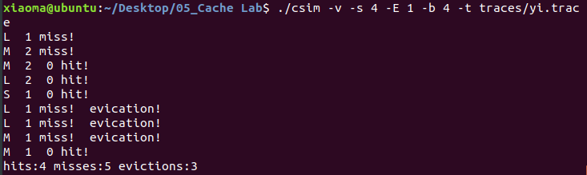

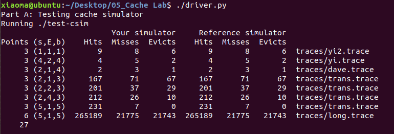

**PART A完成**

### **PART B**
> 在`trans.c`中优化矩阵转置的方法，降低矩阵转置过程中cache的miss数

根据实验文档提示以及`PART A`中的cache结构图可知，本部分中cache有32组，每组有1个cache行，每行存储32比特数据。

则若直接采用通常的矩阵转置方法

```C
void trans(int M, int N, int A[N][M], int B[M][N])
{
    int i, j, tmp;

    for (i = 0; i < N; i++) {
        for (j = 0; j < M; j++) {
            tmp = A[i][j];
            B[j][i] = tmp;
        }
    }    

}

```

在每次读取矩阵A中的某个元素时，与该元素相邻的剩余7比特数据也会被存储到相同的cache行中，若使用通常方法的矩阵转置过程如图所示

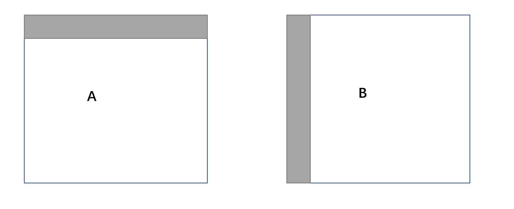

矩阵A按行取数，这正好可以利用cache按行读取的特性，但是矩阵B是按列存储的，这就会导致每次存储都会造成miss，另外根据逻辑地址的映射规则，矩阵A，B的组号是相同的，这就导致了在矩阵B的存储过程中会将cache中已有的矩阵A的元素替换掉，又造成了miss，故对于实验给定的cache而言，通常的矩阵转置方法是十分不合理的。

所以需要极大程度的利用cache按行读取的特征来减少cache替换的次数，而整个cache最多只能存储大小为$8 \times 8$的矩阵，则每次多读的内容如图所示

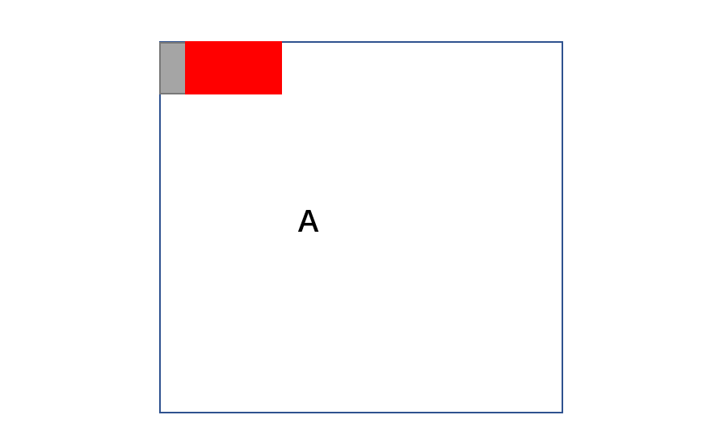

对于矩阵A的每一行，需要4个cache行才能完全存储，若分块进行转置，已知转置后的矩阵块与原块关于对角线对称。


则有对称关系的矩阵块会映射到不同的组中，避免了冲突的情况。

对于对角线上的矩阵块，则无法用同样的方法解决，但已知矩阵块的大小为$8 \times 8$，则可以使用8个（或更少）寄存器来存储一整行的内容，然后一起进行转置操作，这样就可以使cache按行读取后数据得到充分利用。

```C
void transpose_32_32(int M, int N, int A[N][M], int B[M][N])
{
    for(int i = 0; i < 32; i += 8)
    {
        for(int j = 0; j < 32; j += 8)
        {
            for(int k = i; k < i + 8; ++k)
            {
                int a = A[k][j];
                int a1 = A[k][j + 1];
                int a2 = A[k][j + 2];
                int a3 = A[k][j + 3];
                int a4 = A[k][j + 4];
                int a5 = A[k][j + 5];
                int a6 = A[k][j + 6];
                int a7 = A[k][j + 7];

                B[j][k] = a;
                B[j + 1][k] = a1;
                B[j + 2][k] = a2;
                B[j + 3][k] = a3;
                B[j + 4][k] = a4;
                B[j + 5][k] = a5;
                B[j + 6][k] = a6;
                B[j + 7][k] = a7;
            }
        }
    }
}
```

对于大小$64 \times 64$的矩阵，根据地址映射的关系，cache最多只能存4行，则无法用$8 \times 8$的分块矩阵，将原来的$8 \times 8$分块矩阵再分为为$4 \times 4$的更小的分块矩阵

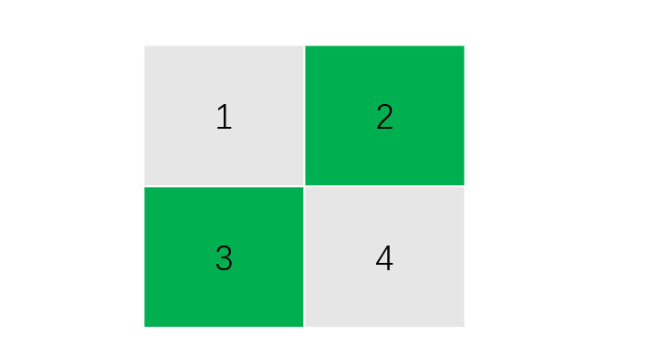

由于矩阵1、2在同一行，则首先可以将矩阵1、2都移动到矩阵B中。

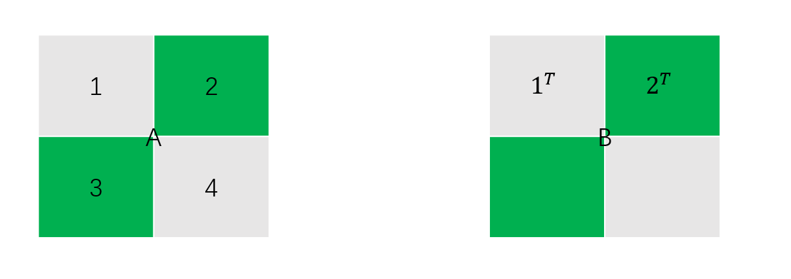

此时整个cache中均为矩阵B的内容，但实际上矩阵B中$2^{T}$的位置是错误的，则使用寄存器将矩阵$2^{T}$的内容保存，先将矩阵A中的矩阵$3$转置存储到矩阵B的右上角，再根据寄存器的内容将矩阵$2^{T}$还原

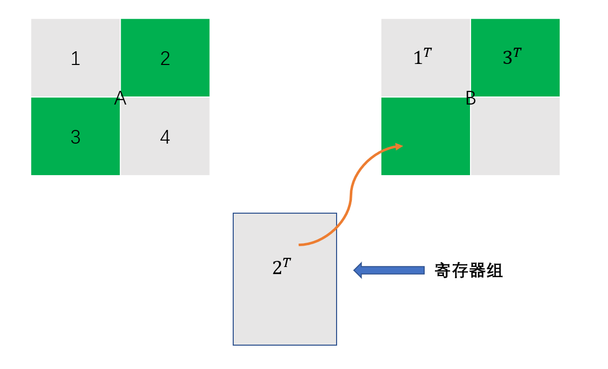

最后将矩阵A中的$4$转置存储到矩阵B的右下角，这样就保证了矩阵B始终在cache中未被换出，减少了miss的次数。

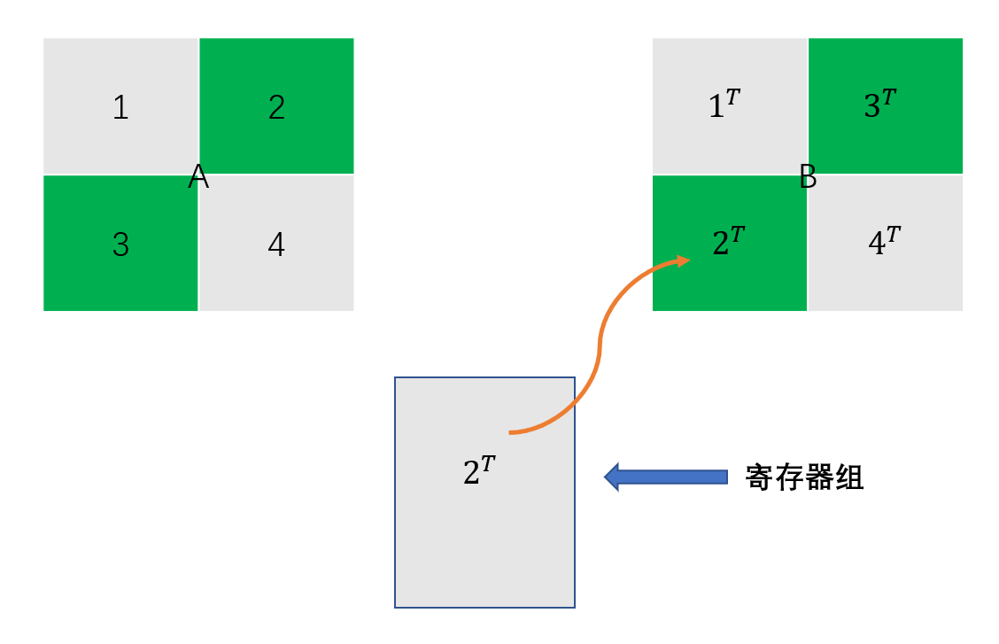

```C
void transpose_64_64(int M, int N, int A[N][M], int B[M][N])
{
    int a;
    int a1;
    int a2;
    int a3;
    int a4;
    int a5;
    int a6;
    int a7;
    
    for(int i = 0; i < N; i += 8)
    {
        for(int j = 0; j < M; j += 8)
        {
            for(int k = i; k < i + 4; ++k)
            {
                a = A[k][j];
                a1 = A[k][j + 1];
                a2 = A[k][j + 2];
                a3 = A[k][j + 3];
                a4 = A[k][j + 4];
                a5 = A[k][j + 5];
                a6 = A[k][j + 6];
                a7 = A[k][j + 7];

                B[j][k] = a;
                B[j + 1][k] = a1;
                B[j + 2][k] = a2;
                B[j + 3][k] = a3;
                B[j][k + 4] = a4;
                B[j + 1][k + 4] = a5;
                B[j + 2][k + 4] = a6;
                B[j + 3][k + 4] = a7;
            }
            for(int k = j; k < j + 4; ++k)
            {
                a = B[k][i + 4];
                a1 = B[k][i + 5];
                a2 = B[k][i + 6];
                a3 = B[k][i + 7];

                a4 = A[i + 4][k];
                a5 = A[i + 5][k];
                a6 = A[i + 6][k];
                a7 = A[i + 7][k];

                B[k][i + 4] = a4;
                B[k][i + 5] = a5;
                B[k][i + 6] = a6;
                B[k][i + 7] = a7;

                B[k + 4][i] = a;
                B[k + 4][i + 1] = a1;
                B[k + 4][i + 2] = a2;
                B[k + 4][i + 3] = a3;
            
            }
            for(int k = i + 4; k < i + 8; ++k)
            {
                a4 = A[k][j + 4];
                a5 = A[k][j + 5];
                a6 = A[k][j + 6];
                a7 = A[k][j + 7];

                B[j + 4][k] = a4;
                B[j + 5][k] = a5;
                B[j + 6][k] = a6;
                B[j + 7][k] = a7;
            }
        }
    }
}
```

对于大小$61 \times 67$的矩阵，由于限制miss为200次，则最大使用$16 \times 16$的分块矩阵就可以达到要求。

```C
void transpose_61_67(int M, int N, int A[N][M], int B[M][N])
{
    for(int i = 0; i < N; i += 16)
    {
        for(int j = 0; j < M; j += 16)
        {
            for(int k = i; k < i + 16 && k < N; ++k)
            {
                for(int s = j; s < j + 16 && s < M; ++s)
                {
                    B[s][k] = A[k][s];
                }
            }
        }
    }
}
```

通过如下指令验证测试结果

```
make clean
make
./test-trans -M 32 -N 32
./test-trans -M 64 -N 64
./test-trans -M 61 -N 67
```

结果如图所示

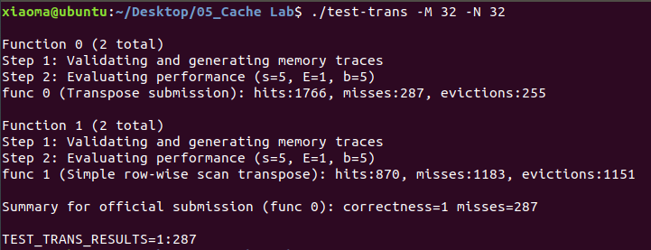

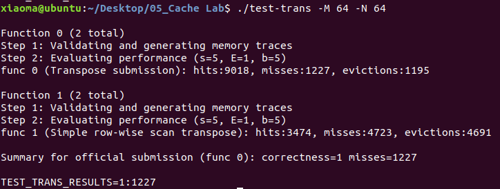

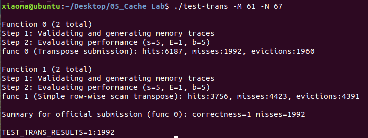


### 测试实验总分

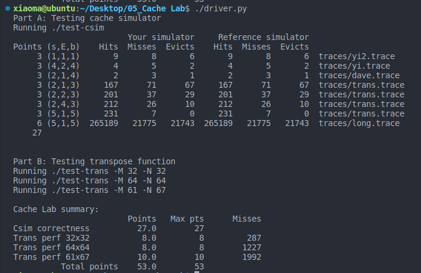


### 实验总结与分析

通过本次实验我对cache的结构、执行过程以及cache替换策略有了更深入的了解，从0开始的实验任务更锻炼了我的代码实现能力，本次实验共用时10h。